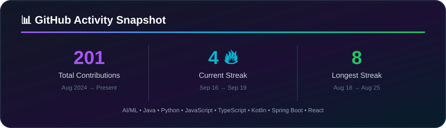

# 👋 Hi, I'm Ashutosh Panwar

**⚡ I build practical software that turns ideas into working products.**

  
  
  
  

---

## 🧭 About Me

> 💡 **Developer focused on AI/ML, full-stack engineering, Android and data-driven applications.**

<table>
<tr>
<td width="58%" valign="top">

🎓 **B.Tech Computer Science & Engineering graduate**

🤖 Interested in **AI/ML, Generative AI, LLMs, RAG, NLP & Data Analytics**

🌐 Building with **Next.js, React, Node.js, Express.js, Spring Boot & REST APIs**

📱 Developing Android applications with **Java, Firebase, SQLite & XML**

🧩 Enjoy **problem solving, debugging, API integration, testing & deployment**

🚀 Comfortable with **Git, GitHub, Vercel, Railway, Postman & Swagger**

💼 Open to opportunities in **Software Development, AI/ML, Full-Stack, Android & Data**

</td>
<td width="42%" valign="top">

### ⚡ What I Bring

| | Strength |
|---|---|
| 🧠 | Problem Solving |
| 🔧 | Debugging & Testing |
| 🔗 | API Integration |
| 🗄️ | Database Design |
| 🚀 | Deployment Workflows |
| 📱 | Cross-platform Product Thinking |

</td>
</tr>
</table>

---

## 🛠️ Tech Stack

<b>💻 BUILD &nbsp; • &nbsp; 🤖 AI &nbsp; • &nbsp; 📱 MOBILE &nbsp; • &nbsp; ☁️ DEPLOY</b>

  

### 🤖 AI • ML • Data

  
  
  
  
  
  
  
  

---

## 🚀 Featured Projects

⭐ <b>Selected work across AI/ML, backend engineering, full-stack apps and Android</b> ⭐

<table>
<tr>
<td width="50%" valign="top">

### 🧠 Clinevo
**Smart Inbox Assistant**

AI-focused inbox workflow project for intelligent email triage and productivity.

**Stack:** Python • Flask • Angular • AI/ML

[Repository →](https://github.com/Ashutosh9-pan/Clinevo-smart-inbox-assistant)

</td>
<td width="50%" valign="top">

### 🛡️ RazorGuard-AI
**AI Application**

Machine-learning application built around a Random Forest model and an interactive Flask workflow.

**Stack:** Python • Machine Learning • Random Forest • Flask

[Repository →](https://github.com/Ashutosh9-pan/RazorGuard-AI)

</td>
</tr>

<tr>
<td width="50%" valign="top">

### 🎓 CampusResolve
**Campus Complaint Management**

Full-stack platform with JWT/RBAC, complaint CRUD, evidence uploads, assignment, tracking, notifications, analytics and deployment.

**Stack:** Node.js • Express.js • MySQL • JWT • Railway

[Live Demo →](https://campus-complaint-system-production.up.railway.app) • [GitHub →](https://github.com/Ashutosh9-pan/campus-complaint-system)

</td>
<td width="50%" valign="top">

### ☕ Spring Blog API
**REST Backend**

Spring Boot API built with Spring Data JPA and Swagger/OpenAPI documentation.

**Stack:** Java • Spring Boot • JPA • REST • Swagger

[Repository →](https://github.com/Ashutosh9-pan/week6-spring-blog-api)

</td>
</tr>

<tr>
<td width="50%" valign="top">

### 🛒 NovaCart
**E-commerce Frontend**

Responsive e-commerce interface focused on modern product browsing and polished UI.

**Stack:** React • TypeScript • Vite

[Repository →](https://github.com/Ashutosh9-pan/novacart-ecommerce-frontend)

</td>
<td width="50%" valign="top">

### 🌿 VitaFit
**AI Fitness Tracker**

Android fitness app with tracking, statistics, reminders, exports and Gemini AI assistance.

**Stack:** Java • Android • Firebase • Gemini AI

[Repository →](https://github.com/Ashutosh9-pan/CodeAlpha_FitnessTrackerApp)

</td>
</tr>

<tr>
<td width="50%" valign="top">

### ✅ TaskFlow
**Interactive Task Manager**

CRUD, search, filters, priorities, due dates, drag-and-drop ordering, progress statistics and backup/restore.

**Stack:** JavaScript • HTML5 • CSS3 • LocalStorage

[Live Demo →](https://ashutosh9-pan.github.io/week2-task-manager/) • [GitHub →](https://github.com/Ashutosh9-pan/week2-task-manager)

</td>
<td width="50%" valign="top">

### 📱 LanguageLearn
**Multilingual Learning App**

Vocabulary, grammar, quizzes, pronunciation, dictionary lookup, text-to-speech and progress tracking.

**Stack:** Java • Android • SQLite • REST API

[Repository →](https://github.com/Ashutosh9-pan/CodeAlpha_LanguageLearningApp)

</td>
</tr>
</table>

---

## 💼 Experience

💼 <b>Experience across AI, web development and Java engineering</b>

| Role | Organization | Period |
|---|---|---|
| 💻 Full Stack Java Developer Intern | **The Developers Arena** | Aug 2026 – Present |
| 🌐 Web Development & Designing Intern | **Oasis Infobyte** | Aug 2026 – Present |
| 🤖 Artificial Intelligence Intern | **CodeAlpha** | Aug 2026 |
| 🧑‍💻 Programming Trainee | **SLOG Solutions Pvt. Ltd.** | Jul 2024 – Aug 2024 |

---

## 🎓 Education

**B.Tech — Computer Science & Engineering**  
Institute of Technology, Gopeshwar • 2023 – 2026 • **Graduate**

**Diploma — Civil Engineering**  
Government Polytechnic, Srinagar Garhwal • 2020 – 2023

---

## 🏅 Certifications

🏆 <b>Continuous learning across AI, data, web and programming</b>

---

## 📊 GitHub Activity

  

  

---

## 📈 Current Focus

**AI/ML Engineering** &nbsp;•&nbsp; **Generative AI** &nbsp;•&nbsp; **LLM & RAG Workflows**  
**Spring Boot** &nbsp;•&nbsp; **REST APIs** &nbsp;•&nbsp; **Full-Stack Development**

---

### 🤝 Let's Connect

<a href="https://ashutosh-panwar-portfolio.vercel.app">Portfolio</a>
&nbsp; • &nbsp;
<a href="https://www.linkedin.com/in/ashutosh-panwar-5192951b8">LinkedIn</a>
&nbsp; • &nbsp;
<a href="mailto:ashutoshpanwar07@gmail.com">Email</a>

  

**Building • Learning • Shipping 🚀**

